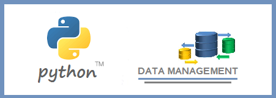

# PYTHON: DATA MANAGEMENT TIPS OVER CONNECTIVITY

 

This project covers the specific topic of connectivity with some of the more frequently used database management systems for relational databases at the present time. 

The principal approach of this work lies in delivering efficient ways of connectivity.  At the same time, it is included specific examples for each case and uses some practical “queries" to get information from databases.

The database management systems considered here are SQLite, MySQL, MS-SQL, MS-ACCESS, and PostgreSQL.  

Python is a highly dynamic ecosystem and it is having a great expansion these days. So, this publication aims to be located as a contribution on the issue of Python connectivity with updated reference in January 2018.

 

### Table of Contents   (  [  Link to Pyhon codes notebook ](http://www.arqmain.net/GITHUBE/Python/Python/Project2/Python_BDatos_Connectivity.html))

#### I INTRODUCTION

#### II DATABASES

#### III CONNECTIVITY WITH PYTHON

##### 31 Python / SQLite

##### 32 Python / PostgreSQL

##### 33 Python / MS_SQL

##### 34 Python / MySQL

##### 35 Python / MS-ACCESS

#### IV REFERENCES

><i>Hector Alvaro Rojas 
>Data Science, Data Analysis, Visualizations and Applied Statistics / January 20, 2018 
>Email: <arqmain2010@gmail.com>  
>Url: [http://www.arqmain.net]   /   GitHub: [https://github.com/arqmain]</i>
